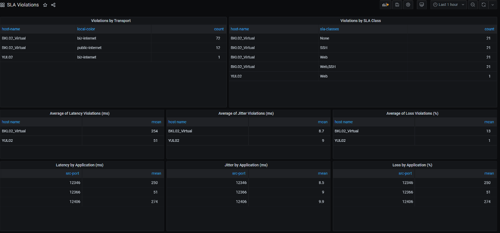
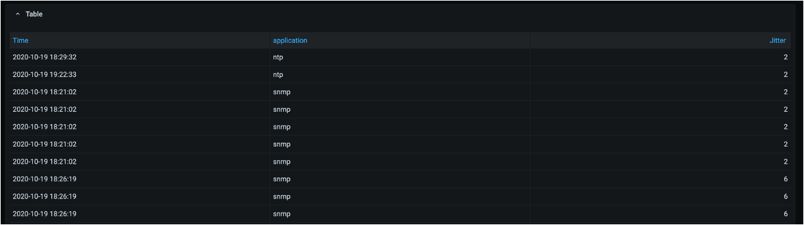

# vManage Statistics Dashboard
This is the Cisco SD-WAN vManage Statistics Dashboard source code. We are able to collect statistics from Cisco SD-WAN through vManage API's, storing them to an InfluxDB database, and visualising them through Grafana dashboards

Adapted from Eduard Schornig's work at https://github.com/schornig/viptela-sdwan-stats-collector


### High Level Design


## Contacts
* Josh Ingeniero (jingenie@cisco.com)
* Monica Acosta (moacosta@cisco.com)
* Eduard Schornig (eschorni@cisco.com)

## Solution Components
* Flask
* Docker
* Python
* Grafana
* InfluxDB
* Cisco vManage API’s

## Installation

#### Clone the repo
```console
$ git clone https://wwwin-github.cisco.com/gve/vmanage-statistics-dashboard.git
```

### Docker
You must have both of these installed
* Docker (https://docs.docker.com/engine/install/)
* docker-compose (https://docs.docker.com/compose/install/)

You may build the docker image from this repo. You may edit [docker-compose.yml](docker-compose.yml) to change the desired timezone:
```yaml
environment:
      TZ: "Asia/Singapore"
```
A list of valid timezones is available at https://en.wikipedia.org/wiki/List_of_tz_database_time_zones under _TZ Database Name_


## Setup:
### Credentials
You can deploy this prototype in a lab environment, dCloud instance, or on your own deployment.
You would need to input your details through the [credentials.yaml](stats-collector-code/credentials.yaml) file below.
You need to have your _VMANAGE IP Address, USERNAME, and PASSWORD_. 

```yaml
#--------------------------------------------------------------------
# Change to your target deployment
#--------------------------------------------------------------------
vManage:
    ip: ip:port    # vManage IP or URL
    desc: lab       # Lab Name (you can put any string in here)
    user: username        # vManage Username
    pass: password            # vManage Password

#--------------------------------------------------------------------
# Only change if using an external DB
#--------------------------------------------------------------------
influxdb:
    db_ip: influxdb-datasource
    db_port: 8086
    db_name: sdwan
    db_user: root
    db_pass: root
```

### Customisation
You may edit the [measurements.yaml](stats-collector-code/measurements.yaml) to edit the existing measurements
or add your own custom measurements. 

```yaml
AppRouteStatsStatistics:
    active: True
    collect_interval: 60 # How often to collect info
    query_type: AggregateAPICall
    query_data:
      url_endpoint: statistics/approute
      series_name: AppRouteStatsStatistics
      stats_interval: 1440 # How far ago should we collect data
      tags: # Independent Variables in Grafana
        - host_name
        - vdevice_name
        - device_model
        - local_color
        - remote_color
        - name
        - statcycletime
        - entry_time
        - tunnel_color
        - remote_system_ip
      fields: # Dependent Variables in Grafana
        - vqoe_score
        - state
        - tx_octets
        - tx_pkts
        - rx_octets
        - rx_pkts
        - latency
        - loss
        - loss_percentage
        - jitter
```

By default, 8 dashboards will be provisioned during the initial deployment of the Grafana container corresponding to 
7 measurements:

| Dashboard Name            | vManage API Endpoint                                | Frequency   |
|---------------------------|-----------------------------------------------------|-------------|
| DeviceHardwareHealth      | device/hardwarehealth/detail                        | 60 seconds  |
| DeviceSummary             | device                                              | 60 seconds  |
| DeviceInterfaceStatistics | statistics/interface                                | 600 seconds |
| DeviceSystemStatusStats   | data/device/statistics/devicesystemstatusstatistics | 600 seconds |
| AppRouteStatsStatistics   | statistics/approute                                 | 60 seconds  |
| DPIStatistics             | statistics/dpi                                      | 60 seconds  |
| SLA Violations            | event                                               | 60 seconds  |
| Application Statistics    | _correlates AppRoute and DPI Statistics_            | 60 seconds  |

The Application Statistics Dashboard is a special dashboard that correlates AppRoute and DPI statistics
to provide Latency, Jitter, and Loss stats for applications. You may find the relevant code in Line 224 of
[viptela-collector.py](stats-collector-code/viptela-collector.py)

## Usage:

### Docker
Launch all docker containers through the docker-compose file.
```commandline
$ docker-compose up
```

Navigate to the Grafana dashboard in your web browser.
```
http://localhost:3000
```

# Screenshots

### SLA Violations


### Application Statistics Correlation



### LICENSE

Provided under Cisco Sample Code License, for details see [LICENSE](LICENSE.md)

### CODE OF CONDUCT

Our code of conduct is available [here](CODE_OF_CONDUCT.md)

### CONTRIBUTING

See our contributing guidelines [here](CONTRIBUTING.md)

#### DISCLAIMER:
<b>Please note:</b> This script is meant for demo purposes only. All tools/ scripts in this repo are released for use "AS IS" without any warranties of any kind, including, but not limited to their installation, use, or performance. Any use of these scripts and tools is at your own risk. There is no guarantee that they have been through thorough testing in a comparable environment and we are not responsible for any damage or data loss incurred with their use.
You are responsible for reviewing and testing any scripts you run thoroughly before use in any non-testing environment.
